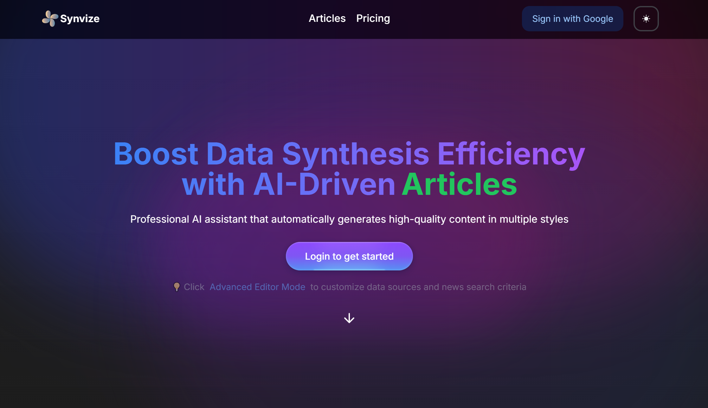
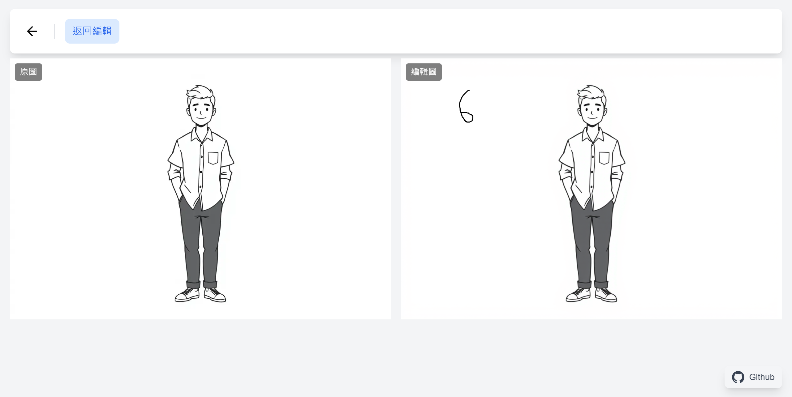
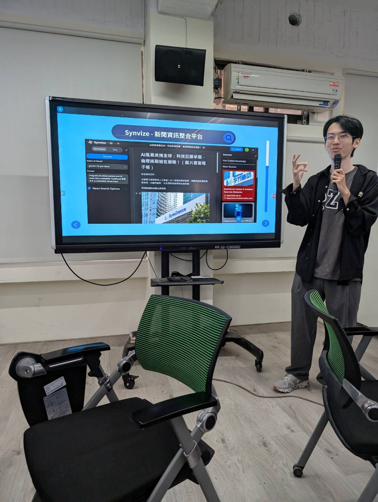

  <a href="README_zh.md">中文</a> | English

  <h1>👋 Hi, I'm Sun (謝上智)</h1>
  
Software Engineer | AI Developer | Unity Expert

  
  
  
  

## 🚀 About Me
I am a passionate software engineer specializing in .NET development, AI applications, and Unity game development. My journey in programming began with Minecraft mod development, which has evolved into extensive professional experience.

I excel at rapidly adopting new technologies and integrating them into practical solutions. My expertise lies in AI integration, enterprise system development, and interactive game design.

Currently focused on enterprise application development and AI technology integration, while continuing to innovate in AR/VR game development. I am dedicated to bringing cutting-edge solutions to the industry while mentoring others in their technical growth.

## 🛠️ Tech Stack

  
  ### Programming Languages
  
  
  
  
  

  ### Frameworks
  
  
  
  
  
  

  ### Game Development
  

  ### AI Technologies
  
  
  
  

  ### Other Skills
  
  
  

## 💼 Professional Experience
### Inventec Corporation - Software Engineer (Dec 2023 - Present)
- Develop and maintain mission-critical internal systems
- Spearhead AI technology integration projects
- Conduct technical knowledge sharing sessions
- Optimize system architecture and performance
- Establish development documentation and standards

### Coolidi Digital Creative - Freelance Software Engineer (Oct 2020 - Present)
- Research and implement AR facial recognition algorithms
- Develop cross-platform mobile applications using Unity
- Create engaging interactive games with close stakeholder collaboration
- Ensure consistent UI/UX across multiple devices
- Optimize application performance and user experience

### Yubay Industrial - Software Engineer (Feb 2023 - Oct 2023)
- Manage development and maintenance of five projects simultaneously
- Quickly understand and resolve programming issues
- Improve project development efficiency
- Establish comprehensive project documentation
- Optimize development processes and architecture

### Field Technology - Game Engineer (Apr 2022 - Feb 2023)
- Develop multiple motion-sensing interactive games
- Implement AR/VR technology integration
- Design computer vision algorithms
- Develop LINE BOT HR system
- Optimize user experience and performance

## 🚀 Featured Projects
### [LexiTechly - Smart English Content Analysis](https://chromewebstore.google.com/detail/lexitechly-%E6%99%BA%E6%85%A7%E8%8B%B1%E6%96%87%E5%85%A7%E5%AE%B9%E5%88%86%E6%9E%90/lnfheajgimgpheflgjgknhnppanfenmk)
Chrome extension that analyzes English web content using Google Gemini AI, providing CEFR level assessment, vocabulary analysis, AI interactive dialogue, and pronunciation features.

  

  
  

  

- CEFR level analysis of web English content
- Comprehensive vocabulary, grammar, and topic difficulty assessment
- Interactive AI dialogue feature
- Vocabulary list and AI lexical analysis
- Word and sentence pronunciation support

### [Synvize](https://synvize.com/)
AI-powered content generation platform that automatically integrates data from websites, YouTube, news, and text sources.

  
  

- Multi-source data collection and integration
- AI-powered analysis and article generation
- Community content sharing and interaction
- Built-in AI assistant for instant answers
- Automated news tracking and updates

### [Snapraze](https://github.com/SunZhi-Will/snapraze)
A platform providing cloud image storage, editing, annotation, and original image comparison features.

  

  

  
  

- Cloud image storage and management system
- Image editing and annotation tools
- Real-time comparison between original and edited images
- Complete modification history tracking
- User permission management

## 📚 Teaching & Sharing

### TED × AI Innovation Applications

  
  

- Share real-world AI application cases across various fields
- Discuss AI development trends and future opportunities
- Interactive discussions on AI innovation ideas

### Unity Computer Vision Course (NPUST)

  

- Teach Unity and MediaPipe integration
- Human pose estimation in games
- Hand tracking and gesture recognition
- Guide student projects
- Share industry experience

## 💡 Professional Services
- Full Stack Development: Website system development and maintenance
- VR/AR Development: Interactive experience design and development
- Game Development: Interactive game development and design
- AI Application: AI application development and integration
- APP Development: Mobile application development and optimization

## 📊 GitHub Stats

  
  

---

  ⭐️ From <a href="https://github.com/SunZhi-Will">SunZhi-Will</a>

