

  中文 | <a href="README.md">English</a>

  <h1>👋 你好，我是謝上智 (Sun)</h1>
  
軟體工程師 | AI 開發者 | Unity 專家

  
  
  
  

## 🚀 關於我
我是一名充滿熱情的軟體工程師，專注於 .NET、AI 應用開發與 Unity 遊戲開發。從 Minecraft 模組開發啟發了我的程式熱情，到現在已累積豐富的實務經驗。

擅長快速掌握新技術並整合應用，將複雜的技術需求轉化為實用的解決方案。特別在 AI 應用整合、企業系統開發與遊戲互動體驗設計方面有深入研究。

目前專注於企業應用系統開發與 AI 技術整合，同時持續在 AR/VR 遊戲開發領域探索創新。期待能為產業帶來更多創新應用，同時也能協助更多人學習與成長。

## 🛠️ 技術棧

  
  ### 程式語言
  
  
  
  
  

  ### 開發框架
  
  
  
  
  
  

  ### 遊戲開發
  

  ### AI 技術
  
  
  
  

  ### 其他技能
  
  
  

## 💼 專業經驗
### 英業達股份有限公司 - 軟體工程師 (2023/12 - 至今)
- 開發與維護企業內部系統
- 參與 AI 技術導入專案
- 進行技術分享與知識交流
- 優化系統架構與效能
- 建立開發文件與規範

### 酷愛迪數位創意 - 外包軟體工程師 (2020/10 - 至今)
- 研究 AR 臉部辨識，開發人臉位置判斷功能
- 使用 Unity 開發跨平台手機 APP 介面
- 開發互動式遊戲，與企劃密切溝通
- 確保 UI 在不同裝置上的一致性
- 優化應用程式效能與使用者體驗

### 宥倍實業股份有限公司 - 軟體工程師 (2023/2 - 2023/10)
- 同時管理五個專案的開發與維護
- 快速理解並解決程式問題
- 提升專案開發效率
- 建立完整的專案文件
- 優化開發流程與架構

### 田野科技有限公司 - 遊戲工程師 (2022/4 - 2023/2)
- 開發多款體感互動遊戲
- 實現 AR/VR 技術整合
- 設計影像辨識演算法
- 開發 LINE BOT 人事系統
- 優化使用者體驗與效能

## 🚀 主要專案
### [LexiTechly - 智慧英文內容分析](https://chromewebstore.google.com/detail/lexitechly-%E6%99%BA%E6%85%A7%E8%8B%B1%E6%96%87%E5%85%A7%E5%AE%B9%E5%88%86%E6%9E%90/lnfheajgimgpheflgjgknhnppanfenmk)
Chrome 擴充功能，使用 Google Gemini AI 分析英文網頁內容，提供 CEFR 等級評估、單字解析、AI 互動對話與語音發音功能。

  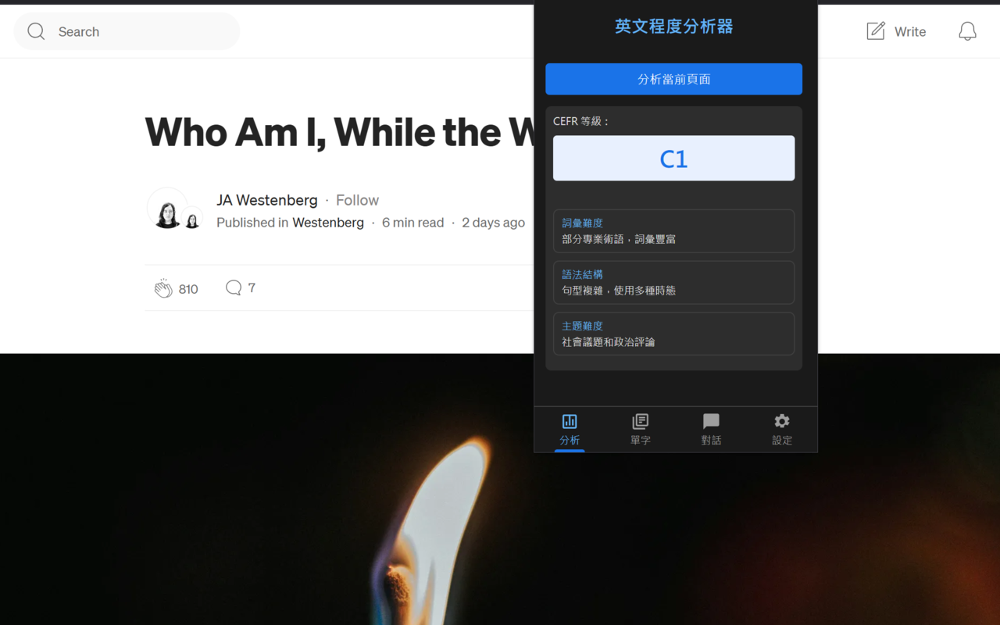

  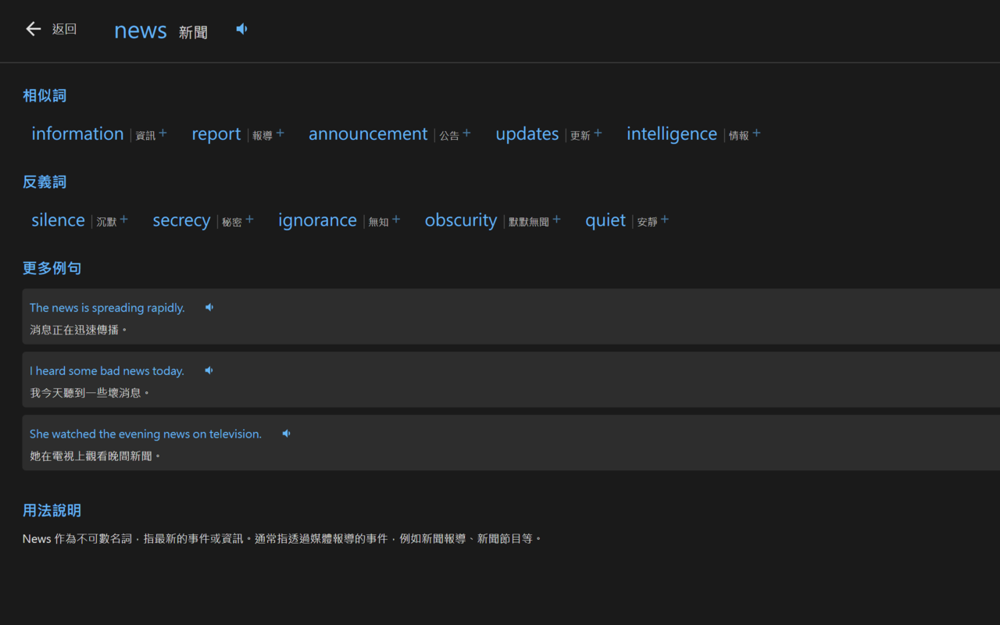
  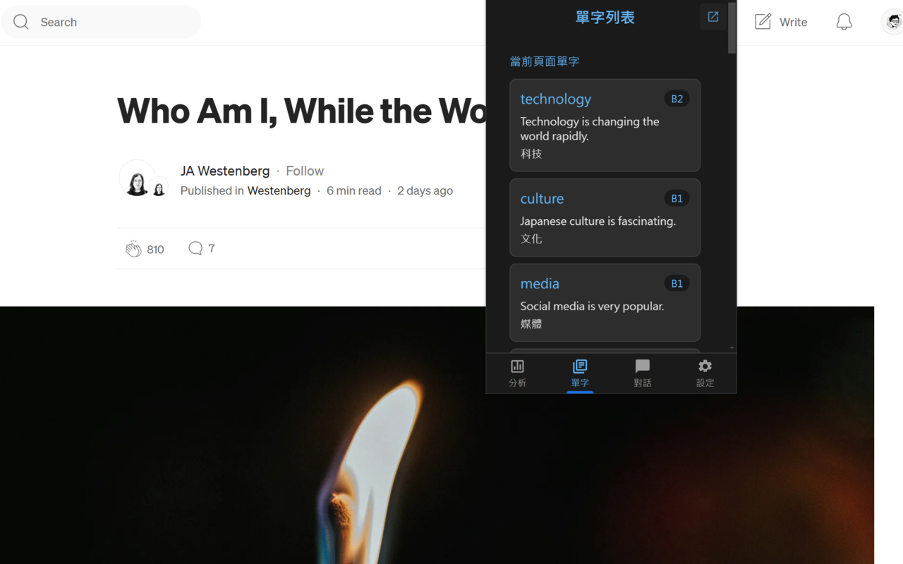

  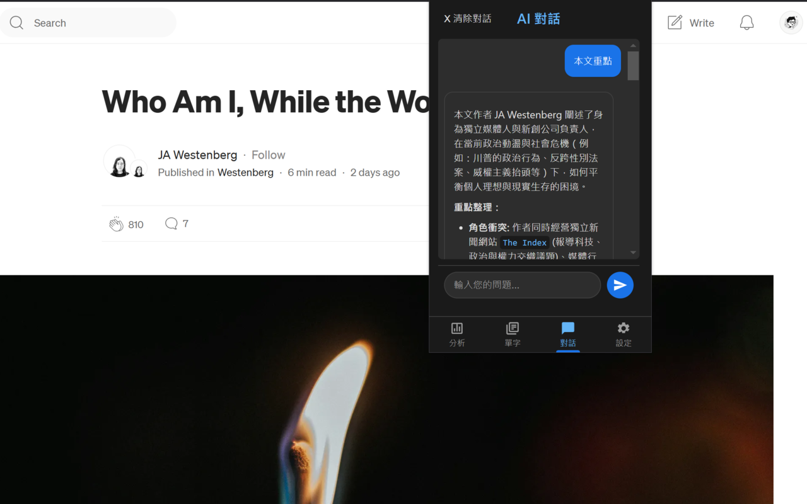

- 網頁英文內容的 CEFR 等級分析
- 全方位的詞彙、語法和主題難度評估
- 互動式 AI 對話功能
- 單字列表與 AI 詞彙分析
- 支援單字和例句的語音播放

### [Synvize](https://synvize.com/)
AI 驅動的內容生成平台，能夠自動整合網站、YouTube、新聞和文本等多元資料來源。

  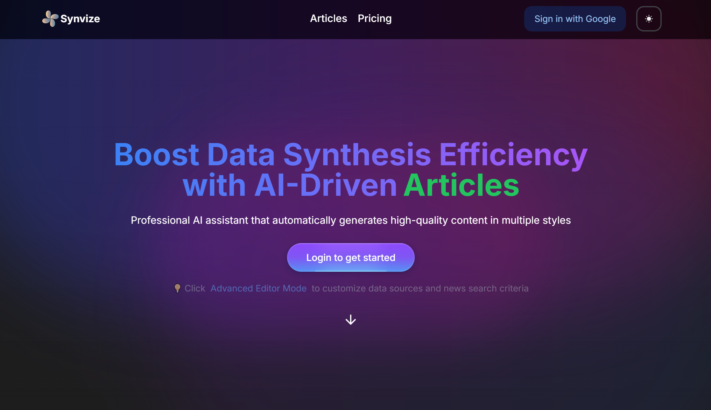
  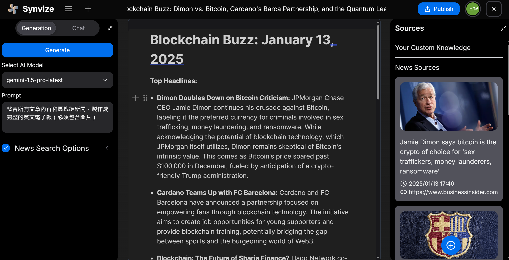

- 多源數據自動蒐集與整合
- AI 智能分析與文章生成
- 社群內容分享與互動功能
- 內建 AI 助手即時解答
- 自動新聞追蹤與更新

### [Snapraze](https://github.com/SunZhi-Will/snapraze)
提供圖片雲端儲存、編輯標記以及原圖比對功能的平台。

  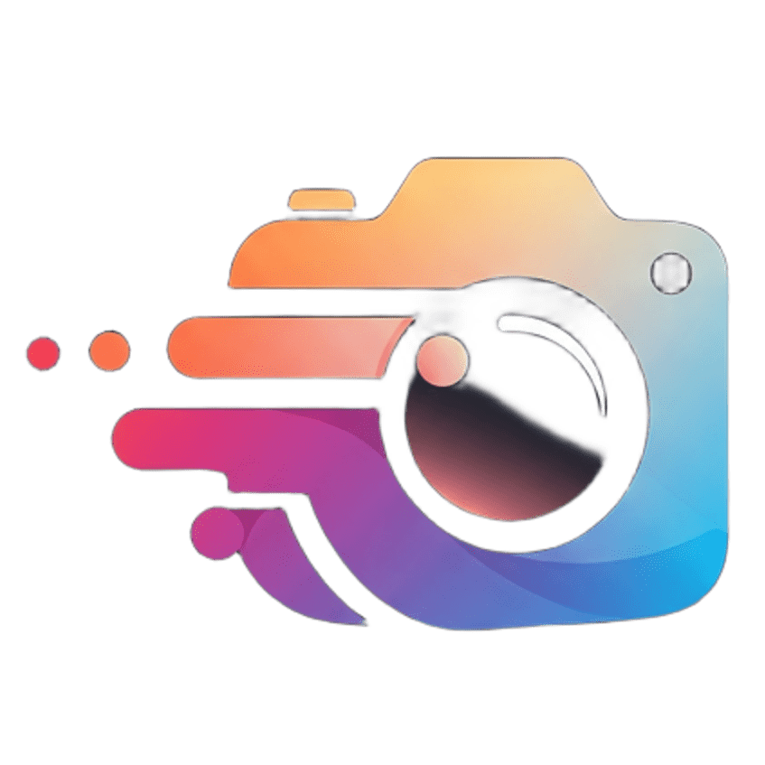

  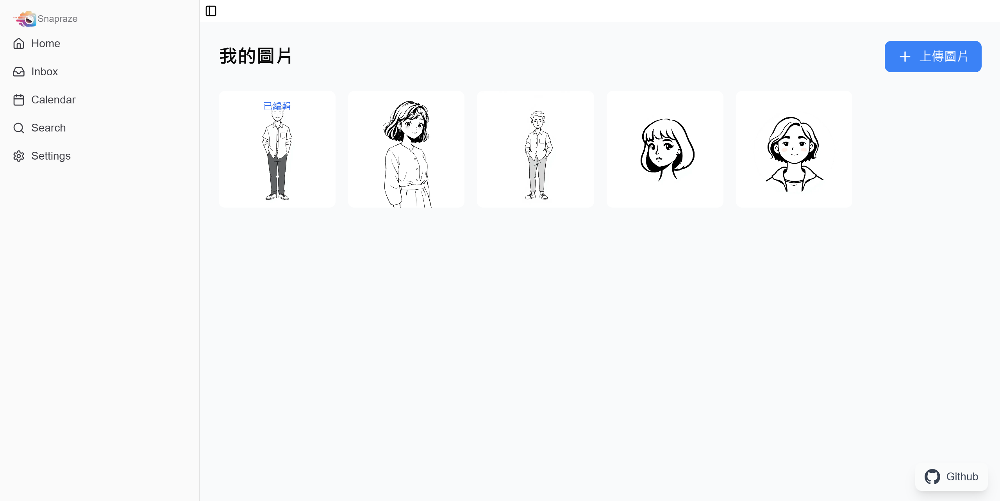

  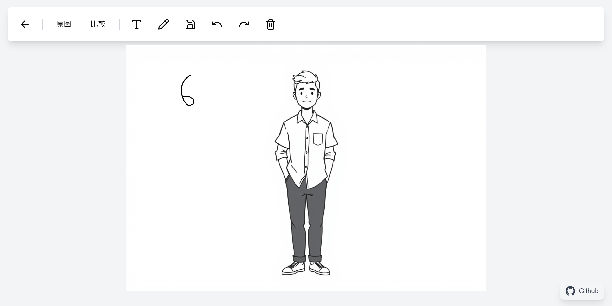
  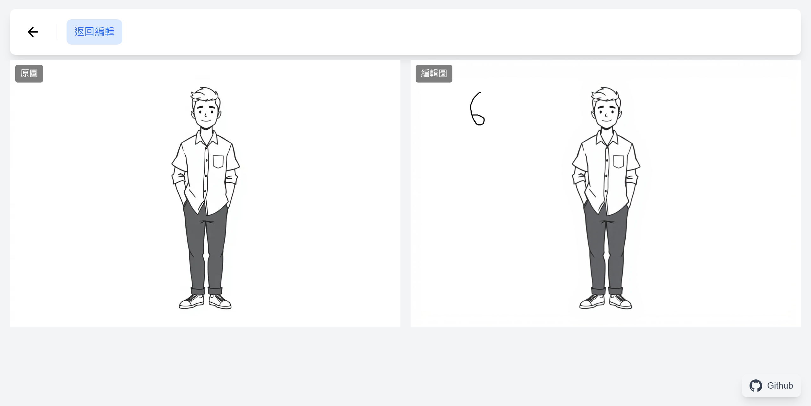

- 雲端圖片儲存與管理系統
- 圖片編輯與標記工具
- 原圖與編輯圖即時比對
- 完整的修改記錄追蹤
- 使用者權限管理

## 📚 教學與分享

### TED × AI 創新應用講座

  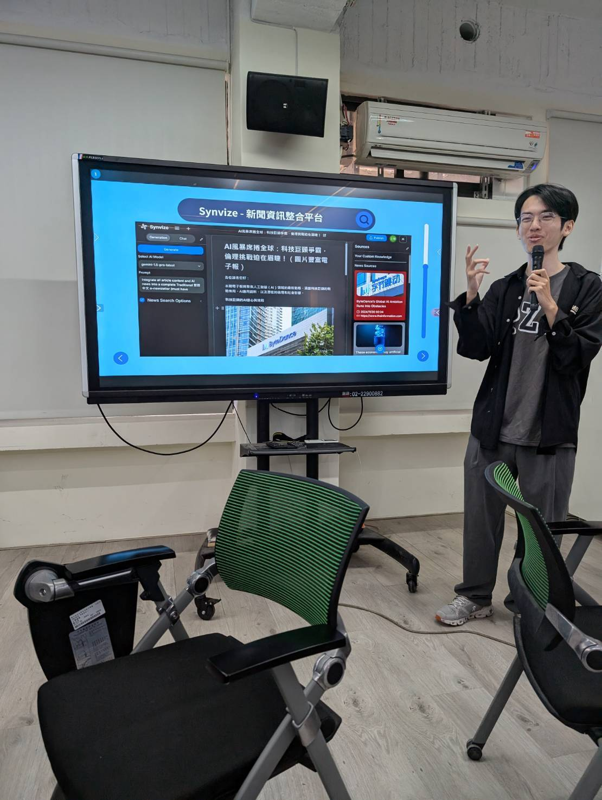
  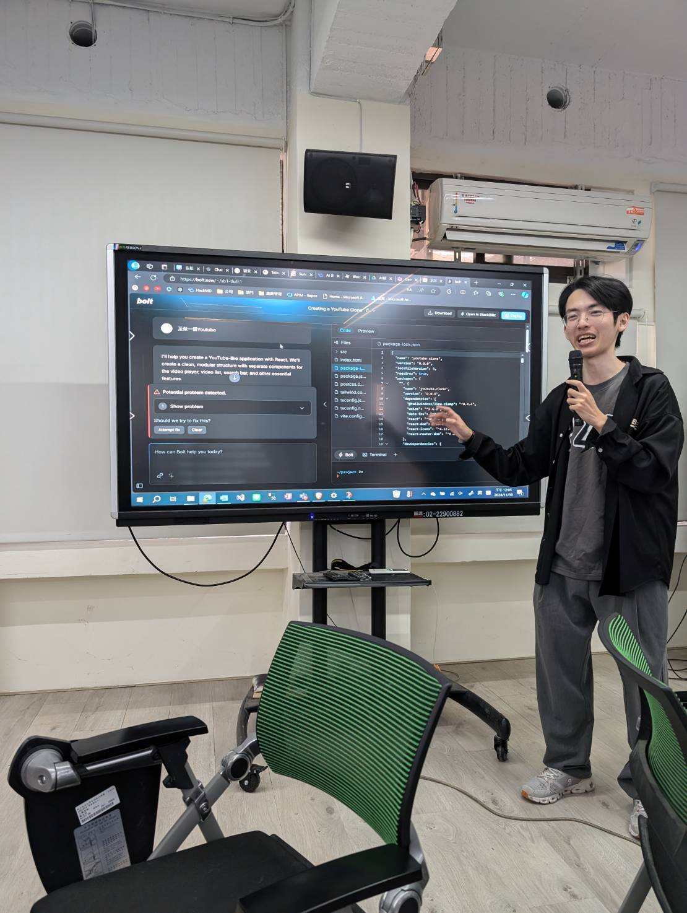

- 分享 AI 技術在各領域的實際應用案例
- 探討 AI 發展趨勢與未來機會
- 與聽眾互動討論 AI 創新想法

### Unity 影像辨識課程 (屏東科技大學)

  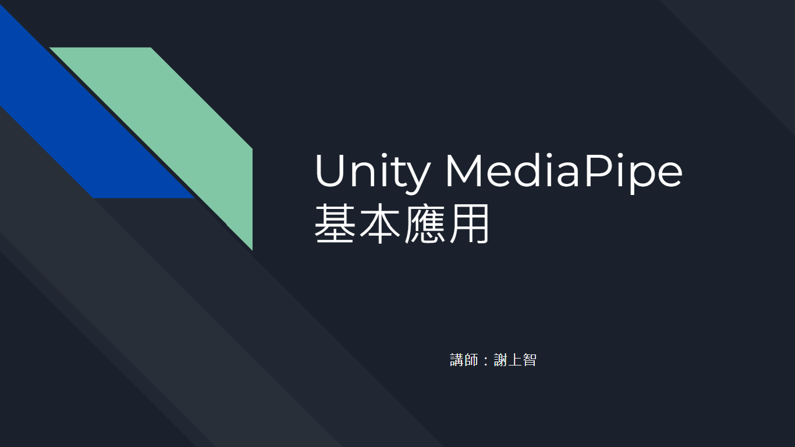

- 教授 Unity 與 MediaPipe 整合技術
- 人體姿態估測在遊戲中的應用
- 手部追蹤與手勢識別實作
- 指導學生專案開發
- 分享業界實務經驗

## 💡 專業服務
- 全端開發：網站系統開發與維護
- VR/AR 開發：互動體驗設計與開發
- 遊戲開發：互動遊戲開發與設計
- AI 應用開發：AI 應用程式開發與整合
- APP 開發：行動應用程式開發與優化

## 📊 GitHub 統計

  
  

---

  ⭐️ From <a href="https://github.com/SunZhi-Will">SunZhi-Will</a>

 